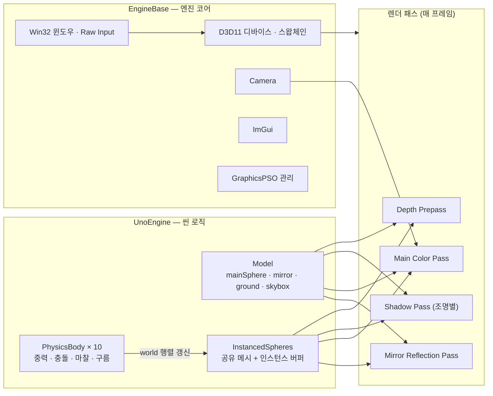
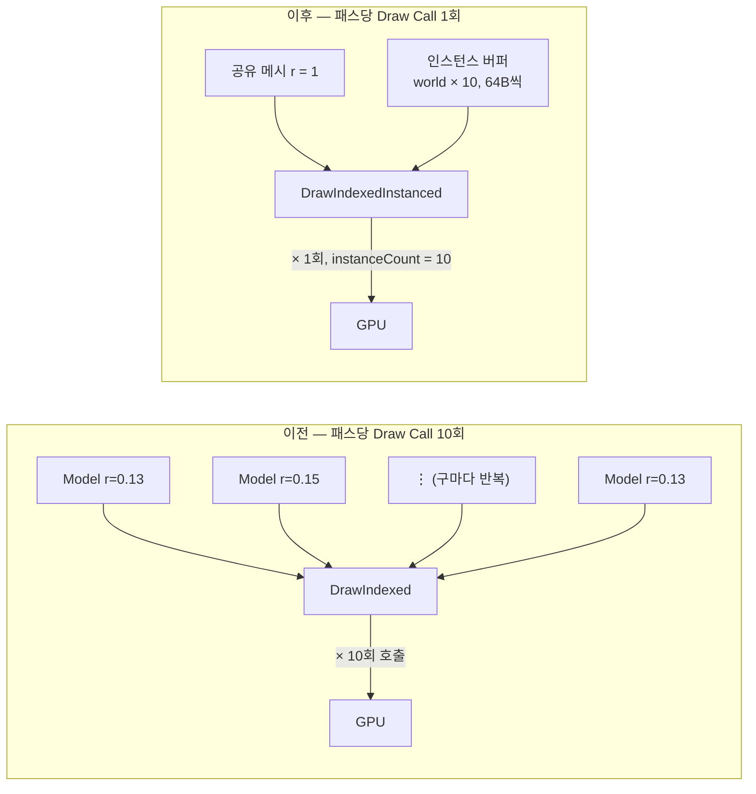

# uno_engine

DirectX11 기반 실시간 렌더링 엔진. PBR 머티리얼, IBL, 실시간 그림자, 거울 반사, 마우스 인터랙션, 자체 구현 물리 시뮬레이션, GPU 하드웨어 인스턴싱까지 렌더링 파이프라인의 기초 요소들을 처음부터 직접 구현하며 만들었습니다.

## 데모 영상

위 썸네일을 클릭하면 유튜브에서 재생됩니다.→ https://www.youtube.com/watch?v=urwAuv5Std0

## 개요

"기초에 충실한 리얼타임 유저 인터랙션 렌더링 엔진"을 목표로 시작한 개인 프로젝트입니다.
라이브러리로 손쉽게 해결하기보다, 카메라·입력 처리부터 PBR 셰이딩, 그림자, 반사, 물리 시뮬레이션, GPU 인스턴싱까지 D3D11 API 위에서 직접 쌓아 올리며  렌더링 파이프라인의 기초 요소들을 하나씩 구현했습니다.

## 주요 기능

- **PBR 머티리얼 렌더링**: Cook-Torrance BRDF(GGX 분포 + Schlick 근사) 기반. Albedo / Normal / Height / AO / Metallic / Roughness 6장의 텍스처를 각각의 용도에 맞게 샘플링해서 합성합니다.
- **IBL (Image-Based Lighting)**: HDRI 큐브맵을 diffuse irradiance와 split-sum prefiltered specular로 나눠 미리 계산해두고, 실시간에는 roughness에 따라 mip을 골라 샘플링합니다.
- **실시간 그림자 매핑**: 광원 시점에서 깊이맵을 뽑아 shadow map으로 사용, 조명별로 독립된 그림자 버퍼를 갖습니다.
- **거울 평면 반사**: 스텐실 기반으로 기본 렌더링, 거울렌더링, 반전렌더링 등 여러번의 렌더링을 거쳐 완성합니다.
- **마우스 인터랙션**: 레이캐스팅으로 오브젝트를 피킹해서 왼쪽 드래그로 회전, 오른쪽 드래그로 이동시킬 수 있습니다.
- **물리 시뮬레이션**: 중력, 바닥/구간 충돌, 반발계수, 마찰, 구름(rolling) 회전까지 자체 구현. 외부 물리 엔진(PhysX, Bullet 등)을 쓰지 않았습니다. 향후 고도화 시에는 외부엔진사용을 고려하고 있습니다.
- **GPU 하드웨어 인스턴싱**: 물리 구 10개를 `DrawIndexedInstanced` 한 번으로 그리면서, 성능최적화를 진행했습니다. 자세한 내용은 아래 GPU 인스턴싱 섹션 참고해주세요

## 엔진 구조

`EngineBase`가 창 생성, 디바이스/스왑체인 초기화, 카메라, ImGui, 파이프라인 스테이트(PSO) 같은 공통 기반을 담당하고, `UnoEngine`이 이를 상속받아 실제 씬(오브젝트, 조명, 물리, 인터랙션)과 4단계 렌더 패스를 구현하는 구조입니다.

## GPU 하드웨어 인스턴싱 — Draw Call 10 → 1

물리 구 10개는 원래 반지름과 색이 각각 다른 개별 `Model`이었습니다. 매 프레임 CPU가 정점/상수 버퍼를 10번 바인딩하고 `DrawIndexed`를 10번 호출하는 구조였는데요.
문제는 그리기 명령 하나가 CPU→드라이버로 넘어갈 때 상태 검증, 커맨드 구성 같은 불필요하고 반복되는 고정 비용이 발생합니다.
오브젝트 개수가 늘어날수록 이 오버헤드가 그대로 배로 늘어나게되겠죠. 
그래서 10개의 구를 하나의 메시와 인스턴스 버퍼로 합쳐서, CPU가 `DrawIndexedInstanced`를 한 번만 호출하도록 구조를 바꿨습니다.

**구현 방식**:
- 반지름 1짜리 메시 하나와 재질(mainSphere와 동일한 돌 PBR 텍스처)을 모든 구가 공유합니다.
- 대신 "이 구가 얼마나 크고 어디에 있는지"를 담은 world 행렬을 인스턴스 버퍼(슬롯 1, `D3D11_INPUT_PER_INSTANCE_DATA`)에 매 프레임 `Map/Unmap`으로 통째로 올립니다.
- 정점 셰이더는 슬롯 0(정점 데이터, 구 하나 분량을 10번 재사용)과 슬롯 1(인스턴스 데이터, 인스턴스마다 한 칸씩 진행)을 자동으로 조합해서 실행됩니다.
- CPU는 `DrawIndexedInstanced`를 딱 한 번만 호출하면 됩니다. 
- 물리 구는 깊이 프리패스·조명별 그림자·메인 컬러·거울 반사까지 4개 렌더 패스에서 그려지기 때문에, 10→1 감소는 이 4곳 모두에 적용했습니다.

RenderDoc으로 프레임을 캡처해서 Event Browser를 열어보면 적용 전에는 물리 구만으로 패스당 `DrawIndexed` 이벤트가 10개 잡히고, 적용 후에는 `DrawIndexedInstanced` 이벤트 1개로 줄어든 것을 직접 확인했다.

## 조작법

| 입력 | 동작 |
| --- | --- |
| `W` `A` `S` `D` | 카메라 이동 |
| 마우스 이동 | 시점 회전 (Raw Input 기반) |
| `F` | 카메라 시점 조작 켜기/끄기 |
| 왼쪽 클릭 드래그 (구 위) | mainSphere 회전 |
| 오른쪽 클릭 드래그 (구 위) | mainSphere 이동 (드래그 중 물리 일시정지) |
| `ESC` | 종료 |

화면 오른쪽 ImGui 패널에서 PBR 텍스처 on/off, 조명 위치/회전, 와이어프레임, 물리 데모 텔레포트 버튼 등을 실시간으로 조절할 수 있습니다.

## 시작하기

1. Visual Studio 2022 (Desktop development with C++ 워크로드)로 `uno_engine.sln`을 실행합니다.
2. x64 / Debug 또는 Release 구성으로 빌드합니다.
3. `Assets` 폴더는 용량 문제로 git에 포함되어 있지 않습니다 (`.gitignore` 처리됨). PBR 텍스처, HDRI, 메시 등을 담은 `Assets` 폴더를 프로젝트 루트에 별도로 준비해야 실행 시 크래시 없이 정상 동작합니다.
  - 따라서 필요한 경우 https://drive.google.com/file/d/1_1qSSS3K2_OgNX0VQPLGliQCuJ9hljoz/view?usp=sharing 에서 다운로드 후 압축을 풀어 `uno_engine` 프로젝트 루트에 `Assets` 폴더를 위치시키면 됩니다.
4. DirectX 11을 지원하는 GPU와 Windows 10/11 SDK가 필요합니다.

## 기술 스택

- C++ / DirectX 11 / HLSL
- DirectXTK (SimpleMath)
- Dear ImGui
- RenderDoc (그래픽스 디버깅 및 검증)

## 참고 자료

- Cook-Torrance / GGX PBR 구현 참고: [Nadrin/PBR](https://github.com/Nadrin/PBR)
- PBR 텍스처: CGAxis 에셋 팩

## 버전 기록

- 버전은 커밋 단위로 관리한다.
- 기능이 하나 추가될 때마다 MINOR 버전을 올린다.
- 버그 수정/리팩토링/문서화/정리성 커밋은 PATCH 버전을 올린다.

현재 버전: **v0.24.0**

### v0.24.0 — 2026-08-16 (`4742ce3`)
**기능 구현** · 촬영용 보조 버튼 및 텔레포트 추가
포트폴리오 영상 촬영을 위해 물리 구 데모를 다시 재생시키는 기능(텔레포트) 등 보조 기능을 추가했다.

### v0.23.1 — 2026-08-16 (`71e775a`)
**수정** · 셰이더 컴파일 설정 변경
Release 빌드에서 셰이더 타입/모델 설정이 Debug 구성에만 걸려있던 문제를 손봤다.

### v0.23.0 — 2026-08-14 (`9b879ef`)
**기능 구현** · GPU 하드웨어 인스턴싱 (Object Instancing)
물리 구 10개를 개별 드로우콜 대신 `DrawIndexedInstanced` 한 번으로 그리도록 바꿔 드로우콜을 대폭 줄였다.

### v0.22.0 — 2026-08-11 (`e187458`)
**기능 구현** · 물리 엔진 4단계: 구름 회전(Rolling)
구가 이동할 때 이동 방향에 맞춰 자연스럽게 회전하도록 구현했다.

### v0.21.0 — 2026-08-07 (`973441a`)
**기능 구현** · 물리 엔진 3단계: 마찰(Friction)
바닥과의 마찰로 속도가 점차 줄어드는 처리를 추가했다.

### v0.20.0 — 2026-08-06 (`460c8f8`)
**기능 구현** · 물리 엔진 2단계: 구-구 충돌
구끼리 부딪혔을 때 운동량을 교환하는 충돌 처리를 구현했다.

### v0.19.1 — 2026-08-04 (`8e1da59`)
**수정** · 적분식 롤백
적분 방식을 바꿔봤다가 오차가 발생하는 걸 확인하고 원래 방식으로 되돌렸다.

### v0.19.0 — 2026-08-04 (`bdf924d`)
**기능 구현** · 물리 엔진 1단계: 중력 + 반발계수
중력을 받아 낙하하고 바닥에 튕기는 기본 물리 시뮬레이션을 시작했다.

### v0.18.1 — 2026-08-03 (`33a7572`)
**문서화** · README 작성
프로젝트 목표와 버전 기록을 정리한 README를 처음 작성했다.

### v0.18.0 — 2026-08-03 (`8ccd06a`)
**기능 구현** · 실시간 그림자 매핑(Shadow Map)
광원 기준으로 깊이맵을 뽑아 실시간 그림자를 드리우도록 구현했다.

### v0.17.4 — 2026-07-27 (`416dcd5`)
**리팩토링** · Light 리팩토링 및 GUI 개선
조명 관련 코드를 정리하고 GUI 구성을 개선했다.

### v0.17.3 — 2026-07-27 (`579ba11`)
**수정** · 유저 인터랙션 버그 수정
드래그 인터랙션 중 발견된 버그를 고쳤다.

### v0.17.2 — 2026-07-27 (`577a062`)
**리팩토링** · PSO 구조 리팩토링
Pipeline State Object 구조를 정리해서 재사용하기 쉽게 바꿨다.

### v0.17.1 — 2026-07-24 (`657efde`)
**수정** · 필터링 로직 변경
텍스처 샘플링 필터링 방식을 조정했다.

### v0.17.0 — 2026-07-23 (`c283042`)
**기능 구현** · 유저 인터랙션(드래그) 기능
마우스로 오브젝트를 집어서 드래그하는 인터랙션을 구현했다.

### v0.16.1 — 2026-07-20 (`63db553`)
**수정** · 거울 깜빡임 버그 수정
거울 반사가 깜빡이던 원인을 추적해서 고쳤다.

### v0.16.0 — 2026-07-16 (`45107f8`)
**기능 구현** · 거울 평면 반사
바닥을 거울처럼 반사시키는 기능을 구현했다 (이 시점엔 깜빡임 버그가 있었음).

### v0.15.1 — 2026-07-12 (`381ca5f`)
**정리** · GUI 코드 임시 주석 처리
작업 중인 GUI 코드를 임시로 꺼뒀다.

### v0.15.0 — 2026-07-10 (`fcb0648`)
**기능 구현** · Light(조명) 기능
조명 기능을 처음으로 구현했다.

### v0.14.2 — 2026-07-08 (`1211b0b`)
**기능(보조)** · 샘플러 추가
텍스처 샘플링용 샘플러 스테이트를 추가했다.

### v0.14.1 — 2026-07-08 (`d85f627`)
**문서화** · 주석 추가
코드에 설명 주석을 보강했다.

### v0.14.0 — 2026-07-07 (`5552b99`)
**기능 구현** · PBR 매핑 및 렌더링 완료
오브젝트에 PBR 재질을 입혀서 렌더링하는 기능을 완성했다.

### v0.13.0 — 2026-07-02 (`9288f71`)
**기능(준비)** · BasicConstantData 구조 변경
PBR 매핑을 받아들일 수 있도록 상수버퍼 구조를 먼저 손봤다.

### v0.12.0 — 2026-07-02 (`aee2e2f`)
**기능 구현** · Wireframe 렌더링 옵션
와이어프레임으로 전환해서 볼 수 있는 옵션을 추가했다.

### v0.11.0 — 2026-07-01 (`9120055`)
**기능 구현** · 포스트프로세싱 렌더링 완성
포스트프로세싱 파이프라인이 실제로 화면에 적용되도록 완성했다.

### v0.10.4 — 2026-07-01 (`97fb276`)
**기능(준비)** · PostProcessing Initialize() 구현
포스트프로세싱 초기화 단계를 먼저 구현했다.

### v0.10.3 — 2026-06-30 (`9da71d5`)
**정리** · 불필요한 코드 제거
안 쓰는 코드를 정리했다.

### v0.10.2 — 2026-06-30 (`7d88eee`)
**문서화** · 주석 추가 및 코드정리
설명 주석을 추가하고 코드를 다듬었다.

### v0.10.1 — 2026-06-29 (`349319d`)
**정리** · GPU 텍스처 변수 정리
GPU로 보내는 텍스처 변수 이름과 순서를 정리했다.

### v0.10.0 — 2026-06-29 (`10621a9`)
**기능 구현** · F키 카메라 유저입력 토글
F키를 눌러 카메라 조작 입력을 켜고 끌 수 있게 했다.

### v0.9.5 — 2026-06-26 (`f58e952`)
**정리** · 불필요한 코드 제거
남아있던 불필요한 코드를 마저 정리했다.

### v0.9.4 — 2026-06-26 (`d875271`)
**수정** · 메인 스피어 카메라 행렬 버그 수정
메인 스피어에 카메라 행렬이 제대로 적용되지 않던 버그를 고쳤다.

### v0.9.3 — 2026-06-26 (`8de6b74`)
**기능(재구현)** · 오브젝트 렌더링 재구현
오브젝트 렌더링 로직을 새로 구현했다.

### v0.9.2 — 2026-06-26 (`13a4554`)
**정리** · 레거시 오브젝트 렌더링 코드 제거
재구현에 앞서 기존 렌더링 코드를 정리했다.

### v0.9.1 — 2026-06-26 (`ed1f916`)
**리팩토링** · 엔진 구조 고도화
엔진 전반의 구조를 다음 작업을 위해 정리했다.

### v0.9.0 — 2026-06-21 (`9b3c37a`)
**기능 구현** · 포스트프로세싱 코드 추가
포스트프로세싱 파이프라인 작업을 시작했다.

### v0.8.0 — 2026-06-19 (`47e1f40`)
**기능 구현** · HDRI 큐브매핑(IBL) 완료
HDRI 기반 이미지 라이팅(IBL) 기능을 완성했다.

### v0.7.3 — 2026-06-19 (`3a8c12d`)
**기능(준비)** · 큐브매핑용 HLSL 셰이더 추가
큐브매핑에 필요한 셰이더를 추가했다.

### v0.7.2 — 2026-06-12 (`cdd3688`)
**수정** · 버텍스 버퍼-인풋 레이아웃 불일치 버그 수정
버텍스 버퍼와 인풋 레이아웃이 안 맞던 버그를 찾아 고쳤다.

### v0.7.1 — 2026-06-10 (`98f2828`)
**이슈** · 런타임 버그 발생
컴파일은 되는데 실행 중 문제가 생겨 추적을 시작했다.

### v0.7.0 — 2026-06-10 (`055ee01`)
**기능(준비)** · HDRI 큐브매핑 추상화 헤더 추가
HDRI 큐브매핑 기능을 위한 헤더 구조를 먼저 만들었다.

### v0.6.4 — 2026-06-10 (`3e03e7c`)
**정리** · 네이밍 정리(rename)
이름을 좀 더 명확하게 바꿨다.

### v0.6.3 — 2026-06-10 (`78beadc`)
**정리** · 네이밍 정리(rename)
이름을 좀 더 명확하게 바꿨다.

### v0.6.2 — 2026-06-10 (`ac719da`)
**정리** · 에셋 추가, 리팩토링
필요한 에셋을 추가하고 관련 코드를 정리했다.

### v0.6.1 — 2026-06-09 (`523d76a`)
**리팩토링** · 카메라/입력 코드 리팩토링
카메라와 입력 처리 코드를 정리했다.

### v0.6.0 — 2026-06-09 (`06e202c`)
**기능 구현** · 마우스 Raw Input(WM_INPUT) 기반 시점 회전
`WM_MOUSEMOVE` 대신 Raw Input으로 마우스 이동량을 받아 카메라 시점을 조작하도록 바꿨다.

### v0.5.0 — 2026-06-09 (`f1324d1`)
**기능 구현** · 마우스 이동 처리 추가
마우스 이동을 받아 처리하는 기능을 추가했다.

### v0.4.0 — 2026-06-09 (`eec95e4`)
**기능 구현** · Shift 전력질주(Sprint)
Shift를 누르면 이동 속도가 빨라지는 기능을 추가했다.

### v0.3.0 — 2026-06-09 (`e479531`)
**기능 구현** · 키보드 이동 + ESC 종료
키보드로 카메라를 이동시키고 ESC로 종료하는 기능을 추가했다.

### v0.2.0 — 2026-06-05 (`7797212`)
**기능 구현** · 카메라 클래스 도입
카메라 클래스를 만들고 AppBase에 연결했다.

### v0.1.2 — 2026-06-05 (`88a2e44`)
**수정** · 테스트 코드 복구
지워졌던 테스트 코드를 복구했다.

### v0.1.1 — 2026-06-02 (`09b9b79`)
**문서화** · 주석 및 초기 문서 작성
초반 코드에 주석을 붙이고 이것저것 정리했다.

### v0.1.0 — 2026-05-29 (`8a7b1ff`)
**초기화** · 프로젝트 초기 설정
프로젝트 골격을 처음 세팅했다.
